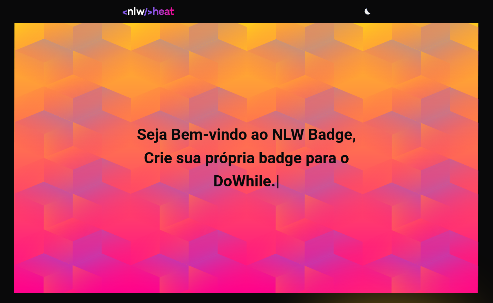
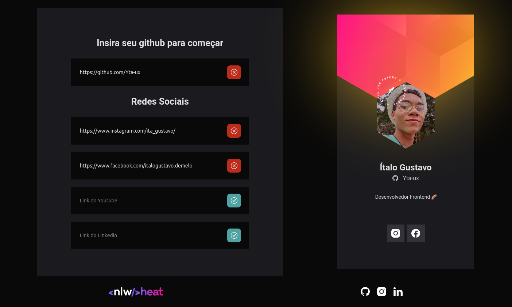

<p align="center">
      <a href="#-projeto">🖥 Projeto</a>&nbsp;&nbsp;&nbsp;|&nbsp;&nbsp;&nbsp;
      <a href="#-tecnologias">👨‍💻 Tecnologias</a>&nbsp;&nbsp;&nbsp;|&nbsp;&nbsp;&nbsp;
      <a href="#-executar-o-projeto">🖇 Execução do Projeto</a>&nbsp;&nbsp;&nbsp;|&nbsp;&nbsp;&nbsp;
      <a href="#-licença">📃 Licença</a>&nbsp;&nbsp;&nbsp;|&nbsp;&nbsp;&nbsp;
      <a href="#-observações">📌 Observações</a>
</p>

<div align="center">
      &nbsp;&nbsp;&nbsp;&nbsp;&nbsp;&nbsp;
      
</div>
  

  ## 🖥 Projeto
Plataforma que cria uma badge personalizada para o evento da DoWhile da Rocketseat.

  ## 👨‍💻 Tecnologias
  As tecnologias usadas nesse projeto foram:
  - [HTML](https://developer.mozilla.org/en-US/docs/Web/HTML)
  - [CSS](https://developer.mozilla.org/en-US/docs/Web/CSS)
  - [JS](https://developer.mozilla.org/en-US/docs/Web/JavaScript)
  - [LocalStorage](https://developer.mozilla.org/en-US/docs/Web/API/Window/localStorage)

  ## 🖇 Executar o Projeto
  Para executar o projeto, apenas é preciso clonar ele em seu dispositivo e entrar na pasta onde o projeto está e:

  - Clone o repositório
    
    
      ```bash
      $ git clone git@github.com:Yta-ux/nlw-Badge.git
      ```
  ##  📃 Licença
  Esse projeto possui licença MIT. Para mais detalhes consulte o arquivo [LICENSE](LICENSE.md)

  ## 📌 Observações
  ...
